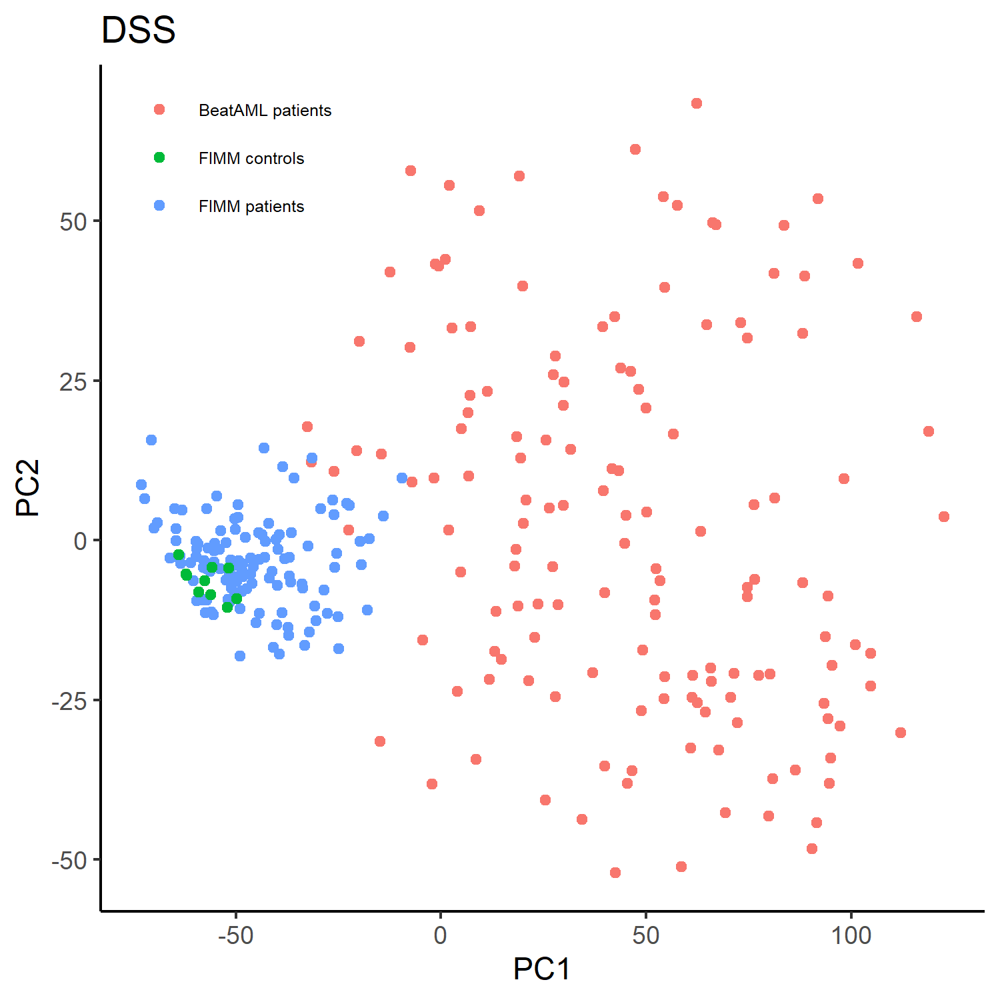
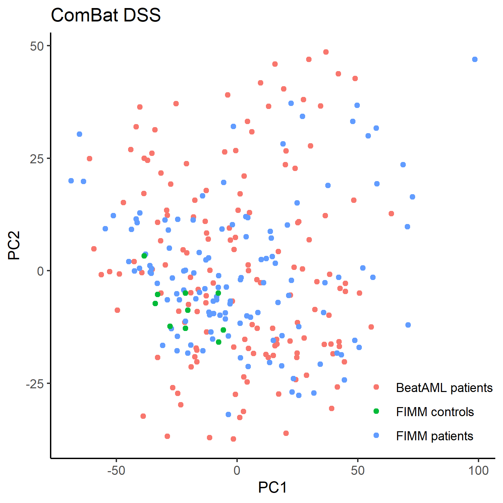

# DSS-v2.0
DSS-v2.0 is a computational pipeline for improved quantification of selective drug responses in cells from cancer patients and healthy controls. The standard drug metrics, such as DSS, AUC and IC50 can be computed in the Breeze application (<https://github.com/potdarswapnil/Breeze>). Based on the healthy control responses, the selective DSS (or sDSS) is calculated as difference between the patient DSS and the average of the healthy control responses. Given enough healthy controls, one can estimate the standard deviation of compound-specific reference distribution over the controls using the z-score statistic. Compared with sDSS, calculation of z-score (zDSS) or robust z-score (rDSS) implements not only location normalization for each compound (like sDSS), but also normalizes the patient responses in terms of variability over the control responses (i.e., scale normalization). When combining drug response profiles from different sources, the [ComBat](<https://academic.oup.com/biostatistics/article/8/1/118/252073?login=false>) batch effect correction method should be used when there appear visible batch effects.


# Instructions
R version 3.5.1 or newer is required.

The way to install packages 'sva' and 'pcaMethods' in Bioconductor differs from other packages in R:
```r
if (!require("BiocManager", quietly = TRUE))
    install.packages("BiocManager")

if (!requireNamespace(c("sva", "pcaMethods"), quietly = TRUE))
    BiocManager::install(c("sva", "pcaMethods"))
```

# Under Linux/Unix
```
# download the example data and R scripts
git clone https://github.com/yingjchen/DSS-v2.0.git

# change the directory
cd ./DSS-v2.0

# start the R program
R
```

# Start by loading libraries and functions
```r
lapply(c("matrixStats","dplyr","reshape","reshape2", "scales", "drc", "caTools","ggplot2", "data.table", "stringr","MESS", "BiocManager","svMisc", "egg", "pheatmap", "sva", "pcaMethods"), library, character.only = T)

source('./DSS.R')
source('./HelperFunctions.R')
```

# Selective DSS calculation example
## Load the example data and compute DSS with *CALC_METRICS* function updated from Breeze

```r
# load the ex vivo dose-response profiles (cell viability at five drug concentrations)
df_dose.responses <- read.csv('./exampleData_procedure1.csv', header = T,sep = ",",check.names = F)

head(df_dose.responses)
```

    ##    DRUG_NAME CONCENTRATION_nM SCREEN_NAME    CELL_VIABILITY
    ## 1 Nelarabine         10000  AML_013_01            0.3012
    ## 2 Nelarabine          1000  AML_013_01            0.5565
    ## 3 Nelarabine           100  AML_013_01            0.7578
    ## 4 Nelarabine            10  AML_013_01            0.9133
    ## 5 Nelarabine             1  AML_013_01            0.8610
    ## 6 Decitabine         10000  AML_013_01            0.4829


```r
# calculate the percentage of growth inhibition 
df_dose.responses.list <- DOSE_RESPONSE_PROCESS(df_dose.responses, viability = T)

# calculate DSS metrics (DSS1, DSS2, DSS3), AUC and relative IC50
df.metrics <- CALC_METRICS(df_dose.responses.list[[1]], df_dose.responses.list[[2]])
```

## Import the control sample DSS profiles
```r
controls.dss <- read.csv('./controls/File_1_Drugname_response_DSS_10Healthy.txt', header = T, sep = '\t', row.names = 1,stringsAsFactors = F, check.names = F)
```
## Calculate the selective drug response scores(sDSS, zDSS, and rDSS)
```r
# compute the descriptive statistics of DSSs for each drug over 10 controls
controls.summary <- as.data.frame(rbind(colMeans(as.matrix(controls.dss)),colSds(as.matrix(controls.dss)),colMedians(as.matrix(controls.dss)), colMads(as.matrix(controls.dss))))

# define names of statistics
rownames(controls.summary ) <- c('mean', 'sd', 'median', 'mad')

# let's set DSS2 as the drug response metrics of patient samples (as an example)
patients.dss <- as.data.frame(acast(df.metrics,df.metrics$Patient.num ~ df.metrics$drug , value.var  = 'DSS2'))

patients.dss[, 1:3]
```
    ##                    1-methyl-D-tryptophan 4-hydroxytamoxifen 8-amino-adenosine
    ## AML_003_01                     0                9.2              25.4
    ## AML_004_01                     0                2.3              22.6
    ## AML_013_01                     0                4.3              23.9
```r
# normalize and scale patient-specific responses to drugs with control DSS profiles
# patient sDSS
patients.sdss <- patients.dss - slice(controls.summary['mean', colnames(patients.dss)],rep(1:n(), each = nrow(patients.dss)))

# patient zDSS
patients.zdss <- (patients.dss - slice(controls.summary['mean', colnames(patients.dss)],rep(1:n(), each = nrow(patients.dss))))/(slice(controls.summary['sd', colnames(patients.dss)],rep(1:n(), each = nrow(patients.dss))) + 1)

# patient rDSS
patients.rdss <- (patients.dss - slice(controls.summary['median', colnames(patients.dss)],rep(1:n(), each = nrow(patients.dss))))/(slice(controls.summary['mad', colnames(patients.dss)],rep(1:n(), each = nrow(patients.dss))) + 1)
```

# Batch effect correction example
To combine drug response profiles from multiple sources, we apply the ComBat algorithm to adjust for the known batch effects. 

```r
# load the example data: DSS2 proiles for 147 BeatAML samples, 125 FIMM-AML samples and 10 healthy controls. 
df.dss <- read.csv('./exampledata_procedure2.csv', header = T,sep = ",",  row.names = 1, check.names = F)
```
One can visualize a Probabilistic PCA (PPCA) plot showing 
the batch effects due to the presence of missing data.
```r
df.dss.1 <- df.dss[, 1 : (ncol(df.dss) - 3)]
res_ppca <- pca(data.matrix(df.dss.1), method = 'ppca', nPcs = 2, seed = 1)
score_ppca <-  as.data.frame(scores(res_ppca))
score_ppca$group <- paste(df.dss$cohort,  df.dss$status,  sep = ' ')

ggplot(score_ppca, aes(x = PC1, y = PC2, color = group)) +
  geom_point() + labs(title = "DSS",  x = "PC1", y = "PC2") +
  theme_classic()
```




Given the differences between two cohorts, let's use the ComBat function from SVA package to correct the batch effects.
```r
df.dss.combat <- ComBat(dat = t(df.dss.1), batch = as.factor(df.dss$cohort), mod = NULL, par.prior = F, prior.plots = F)
````

PPCA of ComBat-corrected DSS profiles
```r
res_ppca_combat <- pca(data.matrix(t(df.dss.combat)), method = 'ppca', nPcs = 2, seed = 1)
score_ppca_combat <-  as.data.frame(scores(res_ppca_combat))
score_ppca_combat$group <- paste(df.dss$cohort,  df.dss$status,  sep = ' ')

ggplot(score_ppca_combat, aes(x = PC1, y = PC2, color = group)) +
  geom_point() + labs(title = "ComBat DSS",  x = "PC1", y = "PC2") +
  theme_classic()
```


# Contact information
For any questions please contact **Yingjia Chen** (yingjia.chen@helsinki.fi)

# Copyright and license
Code copyright *Next-generation scoring of selective drug responses for patient-tailored therapy selection*, yingjia.chen@helsinki.fi
